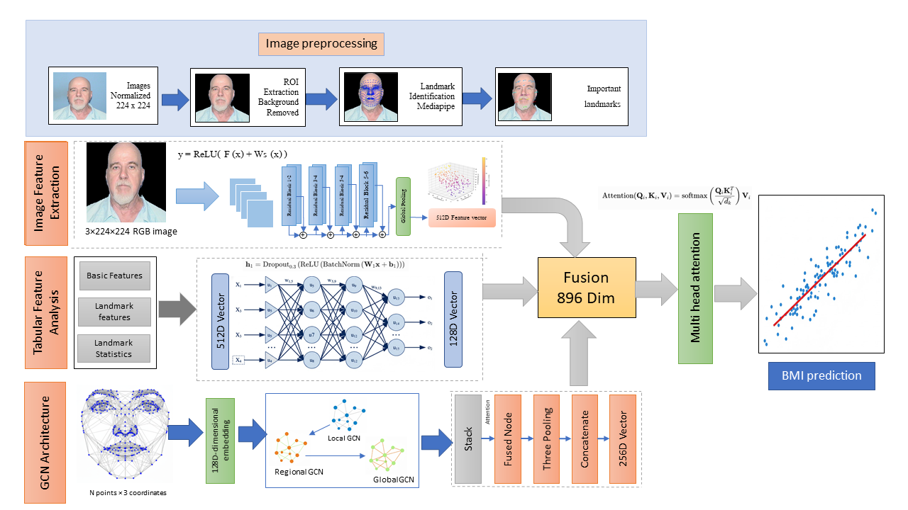

# FaceBMI-Net: End-to-End BMI Prediction from Facial Images

[](https://www.python.org/)
[](https://mediapipe.dev/)
[](https://pytorch.org/)
[](https://opensource.org/licenses/MIT)

FaceBMI-Net is a comprehensive deep learning pipeline designed to predict Body Mass Index (BMI) directly from facial images. By leveraging advanced computer vision techniques like facial landmark detection and geometric feature engineering, the system achieves robust performance across diverse datasets.

---

## 🚀 Key Features

- **Automated Preprocessing**: Real-time background removal and face segmentation using MediaPipe's Selfie Segmentation.
- **Advanced Feature Engineering**: 
  - Extraction of **468 facial landmarks**.
  - Computation of **7 key geometric ratios** (e.g., Cheekbone Width to Jaw Width, Face Height to Lower Face Height).
- **Hybrid Modeling**: Support for multiple architectures:
  - **CNN** for spatial feature extraction.
  - **Graph Neural Networks (GNN)** for relationship modeling between landmarks.
  - **Hybrid Architectures** combining geometric and latent features.
- **Robust Evaluation**: 5-Fold Cross-Validation with metrics including R², MAE, RMSE, and MAPE.
- **Ablation Studies**: In-depth analysis of component contributions (landmarks vs. geometric features).

---

## 🛠 Methodology

The FaceBMI-Net pipeline follows a structured approach from raw image input to precise BMI estimation.



### 1. Data Preprocessing
- **ROI Extraction**: Images are cropped to the Region of Interest (ROI) focused on the face.
- **Segmentation**: MediaPipe is used to isolate the face from complex backgrounds, reducing noise for the model.

### 2. Feature Extraction
- **Landmarks**: 468 3D landmarks are detected to map the facial structure.
- **Geometric Ratios**:
    - **CWJWR**: Cheekbone Width to Jaw Width Ratio.
    - **CWUFHR**: Cheekbone Width to Upper Face Height Ratio.
    - **PAR**: Perimeter to Area Ratio.
    - **ASoE**: Average Size of Eyes.
    - **FHLFHR**: Face Height to Lower Face Height Ratio.
    - **FWLFHR**: Face Width to Lower Face Height Ratio.
    - **MEH**: Mean Eyebrow Height.

### 3. Training & Validation
- **K-Fold CV**: Ensuring the model generalizes well by training across 5 different folds.
- **Scalers**: Use of `RobustScaler` and `StandardScaler` to handle outliers in physiological data.

---

## 💻 Tech Stack

- **Core**: Python
- **Deep Learning**: PyTorch, Torch-Geometric
- **Computer Vision**: OpenCV, MediaPipe
- **Data Analysis**: Pandas, NumPy, Scikit-learn
- **Visualization**: Matplotlib, Seaborn

---

## 📂 Project Structure

```text
├── Face2BMI_Complete_Pipeline.ipynb  # Main pipeline notebook
├── methodology/
│   └── Methodology.png               # Architectural diagram
└── README.md                         # Project documentation
```

---

## 🚦 Getting Started

### Prerequisites
- Python 3.8+
- CUDA-enabled GPU (optional but recommended for training)

### Installation
```bash
git clone https://github.com/abidurrahman14004/FaceBMI-Net-Codebase.git
cd FaceBMI-Net-Codebase
pip install -r requirements.txt  # If applicable, or install core libs:
pip install opencv-python mediapipe torch torchvision pandas scikit-learn
```

---

## 📊 Results Summary

The model evaluates prediction accuracy using:
- **Mean Absolute Error (MAE)**: Measures average deviation from true BMI.
- **R² Score**: Quantifies the variance explained by the facial features.

*Refer to the [Ablation Study] section in the notebook for a detailed breakdown of performance across different feature sets.*

---

## 📄 License
This project is licensed under the MIT License - see the LICENSE file for details.

## 🤝 Acknowledgments
- Inspired by research in physiological attribute estimation from visual data.
- Thanks to the MediaPipe team for robust facial landmarking tools.
